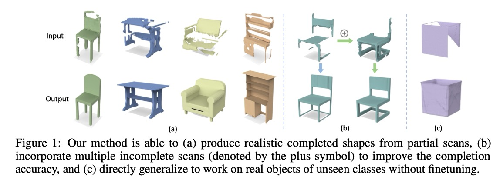

# DiffComplete: Diffusion-based Generative 3D Shape Completion [NeurIPS 2023] 

### [**Project Page**](https://ruihangchu.com/diffcomplete.html) | [**Paper**](https://arxiv.org/abs/2306.16329) | [**YouTube**](https://www.youtube.com/watch?v=aCBu5yZEvVI)

🔥🔥🔥 DiffComplete is a novel diffusion-based approach to enable multimodal, realistic, and high-fidelity 3D shape completion.



# Environments
You can easily set up and activate a conda environment for this project by using the following commands:
```angular2html
conda env create -f environment.yml
conda activate diffcom
```

# Data Construction
For 3D-EPN dataset, we download the original data available from [3D-EPN](https://graphics.stanford.edu/projects/cnncomplete/data.html) for both training and evaluation purposes.
To run the default setting with a resolution of $32^3$, we download the necessary data files [shapenet_dim32_df.zip](http://kaldir.vc.in.tum.de/adai/CNNComplete/shapenet_dim32_df.zip) and [shapenet_dim32_sdf.zip](http://kaldir.vc.in.tum.de/adai/CNNComplete/shapenet_dim32_sdf.zip) for the completed and partial shapes, respectively. 

To prepare the data, you can run ```data/sdf_2_npy.py``` convert the files to ```.npy``` format for easier handling. Then, run ```data/npy_2_pth.py``` to obtain the paired data of eight object classes for model training.

The data structure should be organized as follows before training.

```
DiffComplete
├── data
│   ├── 3d_epn
│   │   ├── 02691156
│   │   │   ├── 10155655850468db78d106ce0a280f87__0__.pth
│   │   │   ├── ...  
│   │   ├── 02933112
│   │   ├── 03001627
│   │   ├── ...
│   │   ├── splits
│   │   │   ├── train_02691156.txt
│   │   │   ├── train_02933112.txt
│   │   │   ├── ...  
│   │   │   ├── test_02691156.txt
│   │   │   ├── test_02933112.txt
│   │   │   ├── ...  
```

# Training and Inference
Our training and inference processes primarily rely on the configuration files (```configs/epn_control_train.yaml``` and ```configs/epn_control_test.yaml```). You can adjust the number of GPUs used by modifying ```exp/num_gpus``` in these ```yaml``` files. This setting trains a specific model for each object category; thereby you could change ```data/class_id``` in the ```yaml``` file.

To train the diffusion model, you can run the following command:
```angular2html
python ddp_main.py --config-name epn_control_train.yaml
```

To test the trained model, you can denote the paths to the pretrained models by filling in ```net/weights``` and ```net/control_weights``` in the ```yaml``` file, and then run the following command:
```angular2html
python ddp_main.py --config-name epn_control_test.yaml train.is_train=False
```


## Citation
If you find our work useful in your research, please consider citing:
```
@article{chu2024diffcomplete,
  title={Diffcomplete: Diffusion-based generative 3d shape completion},
  author={Chu, Ruihang and Xie, Enze and Mo, Shentong and Li, Zhenguo and Nie{\ss}ner, Matthias and Fu, Chi-Wing and Jia, Jiaya},
  journal={Advances in Neural Information Processing Systems},
  year={2023}
}
```


## Acknowledgement

We would like to thank the following repos for their great work:

- This work is inspired by [ControlNet](https://github.com/lllyasviel/ControlNet).
- This work utilizes 3D-UNet from [Wavelet-Generation](https://github.com/edward1997104/Wavelet-Generation).
